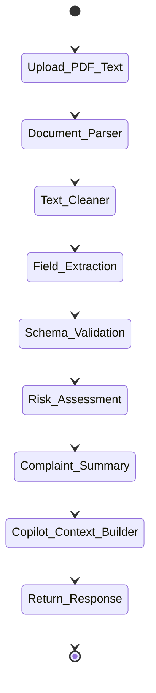

# AI Workflow (LangGraph)

The AI ingestion pipeline uses LangGraph to orchestrate a multi-step process for analyzing unstructured text using `gemma2-9b-it`.

## Workflow Graph



## State Schema (Pydantic)
```python
class ComplaintWorkflowState(BaseModel):
    raw_document: Any
    raw_text: str = ""
    cleaned_text: str = ""
    extracted_data: Optional[Dict] = None
    validation_status: bool = False
    risk_assessment: Optional[Dict] = None
    summary: str = ""
    copilot_context: str = ""
    errors: List[str] = []
```

## Nodes

### 1. Document Parser
- **Purpose:** Extract raw text from uploaded PDFs or parse text strings.

### 2. Text Cleaner
- **Purpose:** Sanitize text, remove unreadable characters, and strip out non-essential boilerplate to reduce token count.

### 3. Field Extraction
- **Purpose:** Parse unstructured text into a structured JSON object.
- **Input:** `cleaned_text`
- **Output:** Updates `extracted_data`.

### 4. Schema Validation
- **Purpose:** Validate the JSON output against Pydantic models. Triggers retry loops if invalid.

### 5. Risk Assessment
- **Purpose:** Analyze the extracted data to determine severity and priority.
- **Output:** Updates `risk_assessment`.

### 6. Complaint Summary
- **Purpose:** Generate a concise, 1-paragraph summary of the incident for quick reading.

### 7. Copilot Context Builder
- **Purpose:** Assemble the extracted fields, summary, and risk assessment into an optimized context prompt string for the Copilot chat.

## Retry Strategy
- Use exponential backoff for Groq API calls (e.g., 429 Too Many Requests).
- Max retries: 3.
- If all retries fail, fail gracefully and return whatever state is populated.
