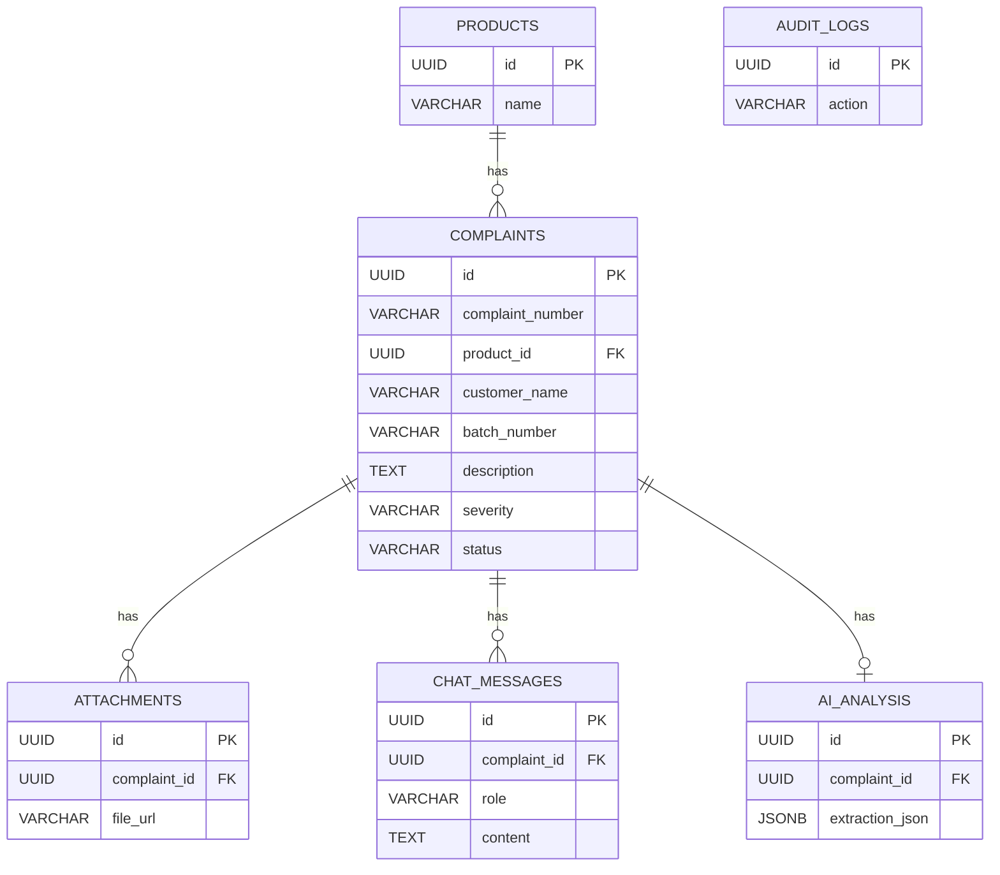

# Database Schema

## Tables

### 1. `complaints`
The core table storing complaint records.
*(id, complaint_number, customer_name, product_id, batch_number, incident_date, description, severity, priority, status, created_at)*

### 2. `products`
Lookup table for pharmaceutical products.
*(id, name, type, formulation, active_ingredients)*

### 3. `attachments`
Stores references to uploaded documents (PDFs, images).
*(id, complaint_id, file_name, file_url, uploaded_at)*

### 4. `chat_messages`
Stores the Copilot chat history for a specific complaint.
*(id, complaint_id, role, content, timestamp)*

### 5. `ai_analysis`
Stores the raw AI outputs and JSON payloads for auditing and retraining.
*(id, complaint_id, extraction_json, risk_json, prompt_version)*

### 6. `audit_logs`
Tracks user actions (edits, approvals).
*(id, user_id, action, entity, entity_id, previous_state, new_state, timestamp)*

## Relationships
- `complaints` belongs to `products`
- `attachments` belongs to `complaints`
- `chat_messages` belongs to `complaints`
- `ai_analysis` belongs to `complaints`

## ER Diagram (Mermaid)

