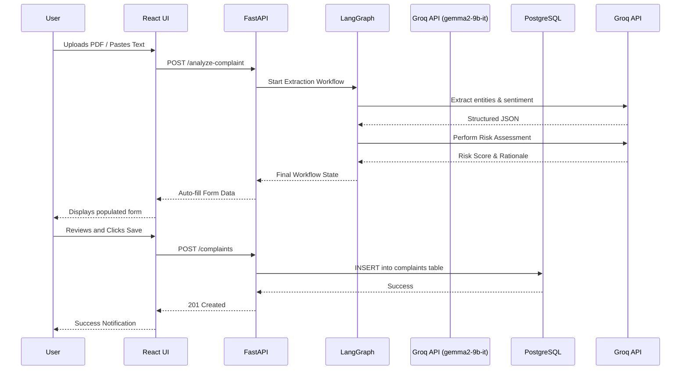

# System Architecture

## Frontend Architecture
- **Framework:** React (Single Page Application)
- **State Management:** Redux Toolkit (Global state, API caching)
- **Routing:** React Router DOM
- **Styling:** TailwindCSS
- **HTTP Client:** Axios

## Backend Architecture
- **Framework:** FastAPI (Python)
- **Concurrency:** Async/Await for non-blocking I/O (crucial for AI calls)
- **Validation:** Pydantic models
- **Routing:** FastAPI Routers modularized by feature

## Database Layer
- **Engine:** PostgreSQL (hosted on Neon)
- **ORM:** SQLAlchemy (Async)
- **Migrations:** Alembic

## AI Layer
- **Orchestration:** LangGraph (Stateful graph-based workflows)
- **LLM Provider:** Groq API
- **Model:** gemma2-9b-it
- **Prompts:** Managed systematically (See [PROMPTS.md](./PROMPTS.md))

## Data Flow
1. Client sends PDF/Text to FastAPI `/api/complaints/analyze`.
2. FastAPI triggers LangGraph workflow.
3. LangGraph node 1 extracts data using Groq API.
4. LangGraph node 2 performs risk assessment.
5. FastAPI returns structured JSON to Client.
6. Client Redux state updates, auto-filling the UI form.
7. User reviews and submits form to FastAPI `/api/complaints`.
8. FastAPI saves to PostgreSQL.

## Sequence Diagram

## Component Interaction
- UI Components are purely presentational or connected to Redux.
- Redux Thunks handle asynchronous API calls to FastAPI.
- FastAPI controllers delegate business logic to Service classes.
- AI Services wrap LangGraph invocation.

## Folder Organization
- `frontend/src/components`
- `frontend/src/features` (Redux slices)
- `backend/app/api` (Routes)
- `backend/app/services` (Business/AI logic)
- `backend/app/models` (SQLAlchemy)
- `backend/app/schemas` (Pydantic)
- `backend/app/ai` (LangGraph definitions)
