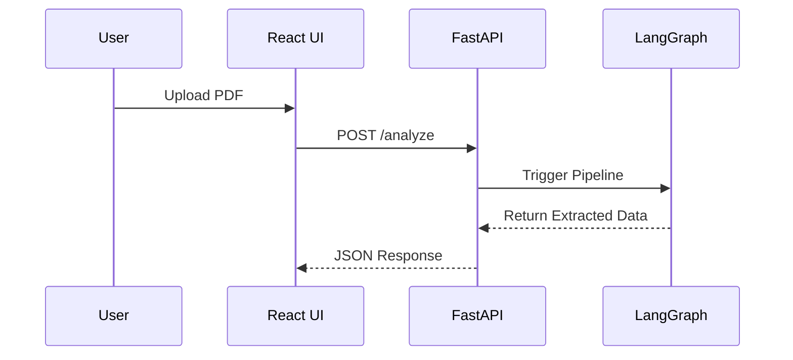
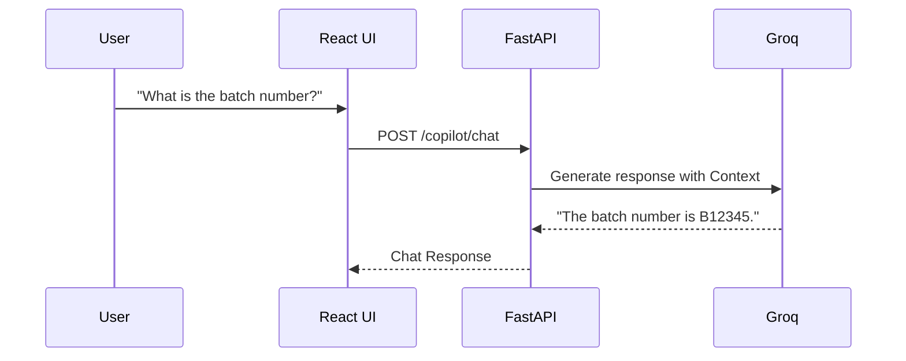
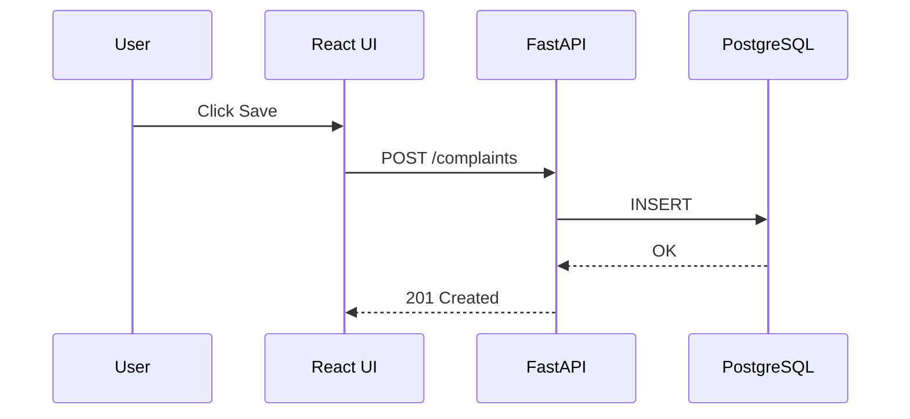

# User Flow & Sequence Diagrams

## 1. Upload Flow
1. User navigates to the "New Complaint" dashboard.
2. User selects a PDF file or pastes text.
3. User clicks "Analyze Complaint".

## 2. Extract Information & Risk Assessment (Background)
1. The frontend sends the data to the backend.
2. The LangGraph workflow executes (9-node pipeline).
3. The backend returns the combined JSON result.

## 3. Populate Form
1. The loading overlay disappears.
2. The UI transitions to the "Complaint Review" screen.
3. The form is automatically populated.

## 4. Copilot Conversation Flow
1. User opens the "AI Copilot" sidebar.
2. User asks a question about the current complaint.

## 5. Review & Edit
1. The user manually verifies the auto-filled fields.
2. The user corrects any inaccuracies.

## 6. Save Complaint
1. The user clicks "Save Complaint".
2. The system validates the form and saves to PostgreSQL.
3. A success toast notification appears.

## 7. View Complaint
1. The user is redirected to the Complaint Details page or Dashboard.
